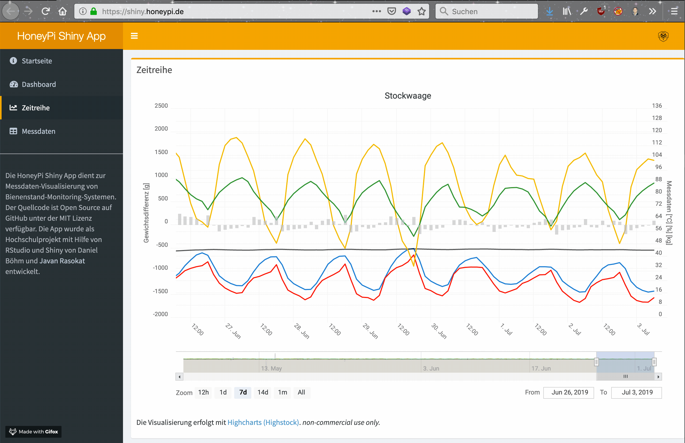
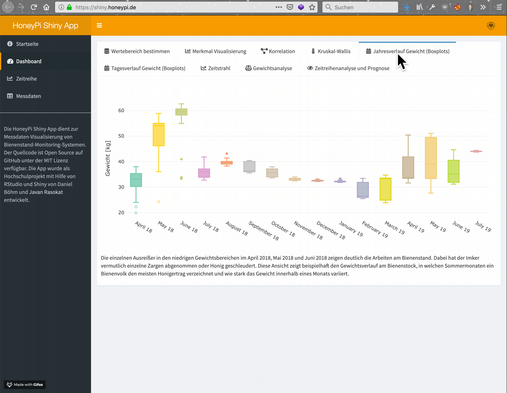

# shiny-beehive

R Shiny app to visualize beehive measurement data.

### Checkout latest code

```
git clone https://github.com/JavanXD/shiny-beehive shiny-beehive
cd shiny-beehive
```

## Screenshots




____


## Run Docker

### Build the docker image
Building the Docker Image is straightforward. Make sure you are in the `shiny-beehive` directory with the Terminal and type in:

```
docker build -t shiny-beehive .
```

Don't forget to make `shiny-server.sh` on your local machine executable. The permissions are copied from your local machine.

```
chmod 755 shiny-server.sh
```

### Run the docker image with your ShinyApp
When this process is done, you can run your ShinyApp in Docker 🎉

```
docker run -p 3838:3838 --name shiny_beehive shiny-beehive
```

Now, you can open the app with any browser by visiting `http://localhost:3838`

To save your Docker Image as a tar-archive, you simply type into your terminal:

```
docker save -o ./shiny_beehive-latest.tar shiny-beehive:latest
```

This file can be for example uploaded to your Plesk Onyx Docker Manager.

Upload to Docker Hub:

```
# Frist create repository at Docker Hub
# Log into the Docker Hub from the command line
docker login --username=javanxd
# tag your image
docker images
docker tag 3d06871c1017 javanxd/shiny-beehive:firsttry
# Push your image to the repository you created
docker push javanxd/shiny-beehive

```

### Helpful links

* Pushing new Docker image to Docker Hub: https://ropenscilabs.github.io/r-docker-tutorial/04-Dockerhub.html
* Transfer ShinyApp Docker image as TAR-File: https://www.bjoern-hartmann.de/post/learn-how-to-dockerize-a-shinyapp-in-7-steps/
